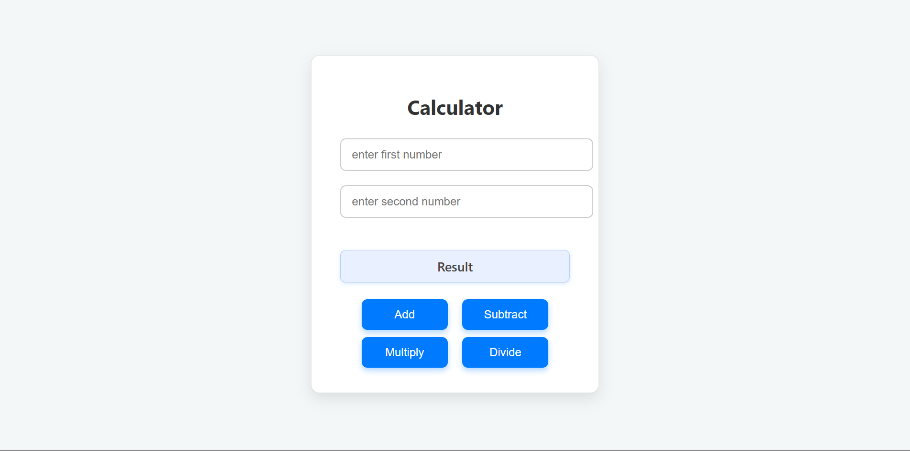

# Calculator OOP Project

## Preview

[view live site]] (https://simple-calculator-xi-two.vercel.app/)

## Description

This is a simple calculator web application built using HTML, CSS, and JavaScript with an object-oriented programming (OOP) approach. The calculator allows users to perform basic arithmetic operations such as addition, subtraction, multiplication, and division on two input numbers.

## Features

- User-friendly interface with input fields for two numbers.
- Buttons to perform addition, subtraction, multiplication, and division.
- Displays the result dynamically.
- Professional styling with background, borders, and rounded corners.

## Technologies Used

- HTML5
- CSS3
- JavaScript (OOP principles)

## How to Use

1. Open the `index.html` file in a web browser.
2. Enter two numbers in the input fields.
3. Click one of the operation buttons (Add, Subtract, Multiply, Divide).
4. The result will be displayed below the buttons.

## Project Structure

- `index.html`: The main HTML file containing the calculator structure.
- `index.css`: Stylesheet for the calculator's appearance.
- `main.js`: JavaScript file (not currently used, but available).
- `oop.js`: JavaScript file implementing the calculator logic using OOP.

## Running the Project

Simply open the `index.html` file in any modern web browser. No additional setup or server is required.

## Author

Created by Maxmillin
